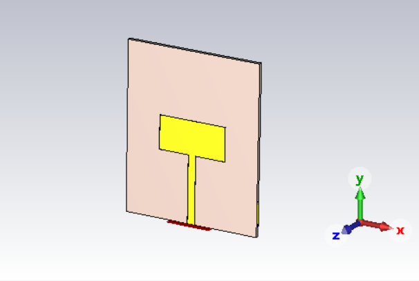
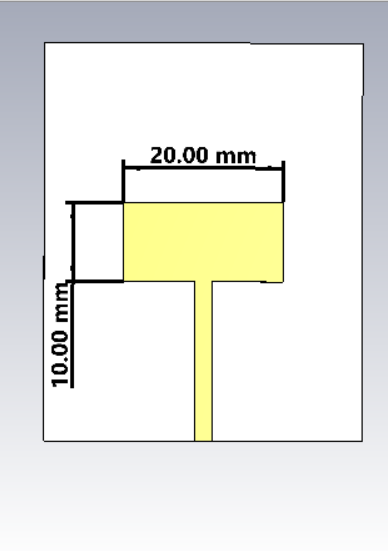
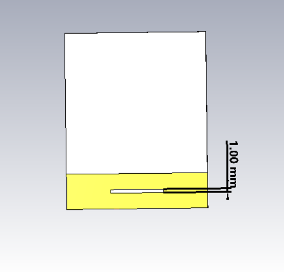
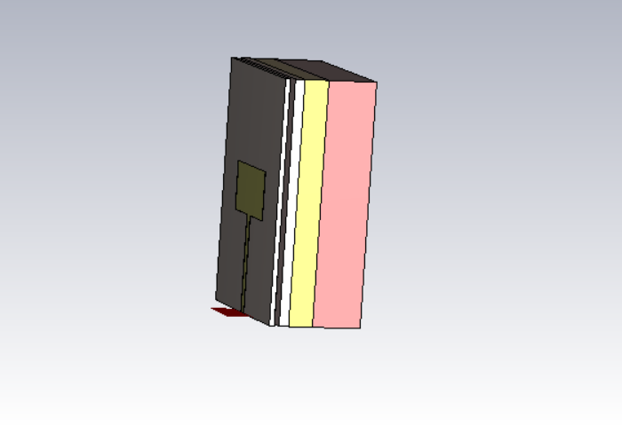
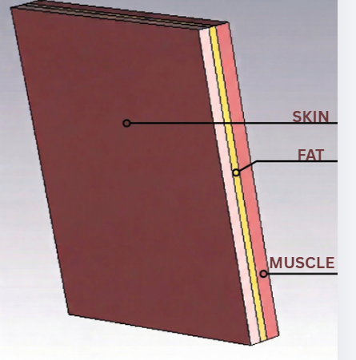
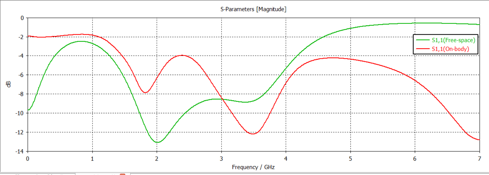
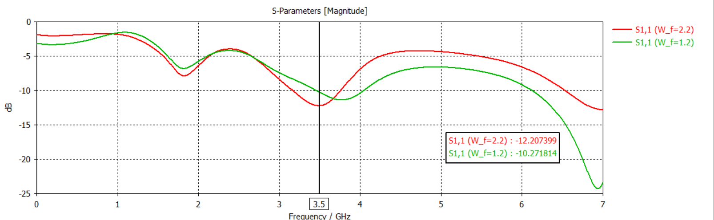
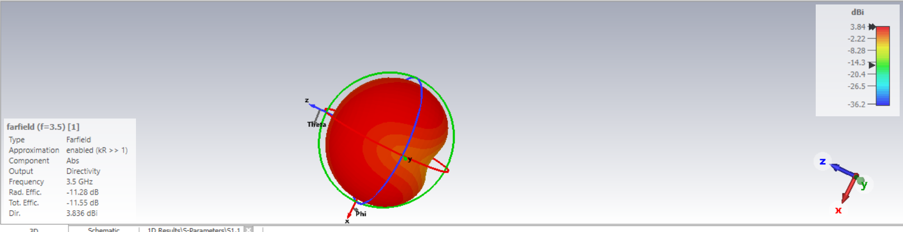
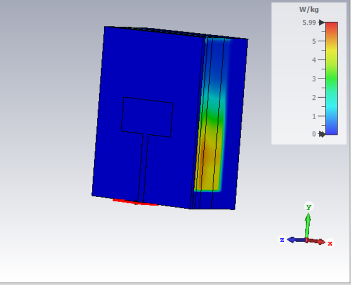

# dgs-wearable-antenna-5g

Miniaturized wearable antenna for 5G n78 (3.5 GHz) using Defected Ground Structure — CST Studio Suite simulation study.

> Simulation only. No fabrication was performed.

---

## What it does

- Designs a compact 10×20 mm wearable patch antenna targeting the 5G sub-6GHz band at 3.5 GHz
- Uses DGS (resonant slot in a heavily modified partial ground) to miniaturize without increasing substrate area
- Places antenna on a 3-layer biological phantom (Skin, Fat, Muscle) to simulate real on-body detuning
- Optimizes microstrip feedline width to recover impedance match lost to tissue loading
- Characterizes SAR at 10g averaged with 0.1 W input power

---

## Design specs

- **Substrate:** Polyimide, h = 1 mm
- **Patch area:** 10 × 20 mm
- **DGS slot length:** L_s = 1 mm
- **Feedline width:** 2.2 mm (optimized for tissue-loaded impedance)
- **Isolation gap:** 1 mm (simulates device casing)
- **Phantom layers:** Skin / Fat / Muscle (realistic dielectric properties)
- **Target band:** 3.5 GHz (5G n78)

---

## Antenna geometry

---

## Tissue phantom setup

3-layer human tissue model placed directly under the antenna with a 1 mm air gap simulating the device housing.

High tissue permittivity causes severe near-field impedance detuning. The feedline was re-optimized to 2.2 mm to recover resonance at 3.5 GHz on-body.

---

## Miniaturization approach

Instead of a solid ground plane or a bulky Frequency Selective Surface (FSS) reflector, a heavily modified partial ground with a resonant slot (L_s = 1 mm) was utilized to lengthen the electrical current path, forcing a lower frequency resonance in a compact 10 × 20 mm active patch area.

This eliminates the need for additional reflector layers, keeping the antenna profile flat and the manufacturing process simple — important for integration into rigid wearable casings like smartwatches or biomedical sensor nodes.

---

## S11 — free space vs on-body

- On-body resonance: **3.5 GHz**
- Return loss: **-12.2 dB**
- Tissue loading shifts and narrows the bandwidth — compensated via feedline tuning

---

## Feedline parametric sweep

Feedline width swept from 1.6 mm to 2.8 mm. 2.2 mm gives the best impedance match under tissue loading conditions.

---

## Radiation performance

- **Directivity:** 3.84 dBi
- **Radiation efficiency:** ~7.4% (-11.28 dB)
- Outward-facing directional lobe confirmed
- Low efficiency is expected — DGS topology has no back-reflector, and backward radiation is absorbed by tissue

---

## SAR analysis

- **SAR (10g avg, 0.1 W input):** 6.0 W/kg
- Peak absorption concentrated at tissue surface directly beneath patch
- SAR is higher than FSS-based designs by design — see trade-off note below

---

## Engineering trade-off — DGS vs FSS

This project is a direct contrast to [fss-wideband-onbody-antenna](https://github.com/vaishakh4002/fss-wideband-onbody-antenna).

| | DGS (this project) | FSS (Project 1) |
|---|---|---|
| Size | 10×20 mm — compact | Larger footprint |
| Profile | Flat, single substrate layer | Multi-layer FSS superstrate |
| SAR | 6.0 W/kg — higher | Lower — FSS acts as back-reflector |
| Efficiency | ~7.4% | Higher |
| Complexity | Simple — no additional layers | More complex fabrication |

DGS prioritizes extreme miniaturization and flat manufacturing profile. SAR is higher because there is no ground-plane shielding layer redirecting radiation away from tissue. In commercial wearable products, SAR compliance at this level is managed through device packaging and regulatory power limits — not the antenna structure itself. This is a known and accepted trade-off in compact wearable antenna design.

---

## Tools

- CST Studio Suite — full-wave FEM/FIT simulation
- Parametric sweep module for feedline optimization
- SAR solver with 10g averaging

---

## Status

Simulation complete. Fabrication not planned for this study.
